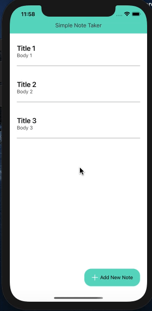

# Session : Mobx state management

Date: 5/4/21

* Make two screens 
* Notes List Screen (Where all the Notes added will be displayed)
* Add/Edit Notes Screen (Where user will add a new note or edit already added notes)
* Use Stack Navigator for Navigation
  
1. Use Mobx for state management
2. By clicking add notes user will be able to add a new note and that note will be displayed on the Notes List Screen
3. By Pressing any note on Notes List screen user will be able to edit and update that note on Add/Edit Note Screen
4. By Long Pressing any note user will get alert to delete that particular not

Screen example : 
https://drive.google.com/file/d/10SZ-HCJ9lXfzGnF0MITxfz_mAEnEXFdF/view

## Output

</img>